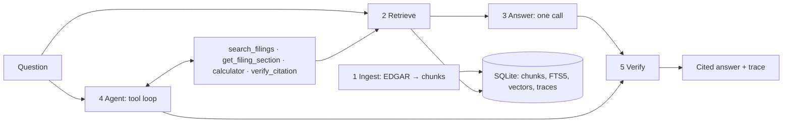

# 10k-agent

**Grounded, cited research over SEC 10-K filings, with an evaluation that proves it works.** Ask a question about 8 companies' annual reports; it finds the passages, calculates with a tool, checks every number against its source, and says plainly when the filings can't answer.

```text
$ tenk research "What was Google's capital expenditure in 2025?"
✓ Searching GOOGL FY2025 for “capital expenditure”
    5 results: GOOGL-FY2025-7-035, GOOGL-FY2025-7-012, GOOGL-FY2025-7-002, GOOGL-FY2025-8-117, GOOGL-FY2025-1A-001
✓ Verifying 91.4 in GOOGL-FY2025-7-035
    found '$91.4 billion'
✓ Verifying 91.4 in GOOGL-FY2025-7-012
    found '$91.4 billion'
✓ Calculating pct_change
    (new - old) / old * 100 = 74.0952
Google (Alphabet) reported capital expenditures of $91.4 billion for fiscal year 2025, which ended on December 31, 2025 [1].
This represents a 74.1% increase from $52.5 billion in fiscal year 2024 [2]. …
  [1] verified   Google (Alphabet) reported capital expenditures of $91.4 billion for fiscal year 2025.  (GOOGL-FY2025-7-035, GOOGL-FY2025-7-012)
  [2] verified   Google (Alphabet) reported capital expenditures of $52.5 billion for fiscal year 2024.  (GOOGL-FY2025-7-035)
  [3] calculated Google's capital expenditures in fiscal year 2025 increased by 74.1% compared to fiscal year 2024.  (GOOGL-FY2025-7-035)

openai:Qwen/Qwen3.5-9B · 27.2s · 23,213 in / 1,056 out · $0.0062
```
*A real Research-mode run (Qwen3.5-9B on vLLM): "Google" resolved to Alphabet, the growth rate came from the calculator, and every number points at the chunk that shows it.*

## Pipeline



| Stage | Question it answers | Method | Guide |
|---|---|---|---|
| 1 **Ingest** | What's in each 10-K, and where? | EDGAR HTML → sections by Item → chunks; tables kept whole | [STAGE1_INGEST](docs/STAGE1_INGEST.md) |
| 2 **Retrieve** | Which passages answer this? | One search per company and filing named; dense vectors + cross-encoder rerank | [STAGE2_RETRIEVE](docs/STAGE2_RETRIEVE.md) |
| 3 **Answer** (Ask mode) | What's the short, cited answer? | One model call over the top 8 chunks → JSON claims with chunk IDs | [STAGE3_ANSWER](docs/STAGE3_ANSWER.md) |
| 4 **Agent** (Research mode) | What does a multi-step question need? | Hand-written tool loop: search, read sections, calculate, check; streams each step | [STAGE4_AGENT](docs/STAGE4_AGENT.md) |
| 5 **Verify** | Is every number really in what it cites? | Deterministic check with unit normalization; failed claims labeled, the agent gets one repair round | [STAGE5_VERIFY](docs/STAGE5_VERIFY.md) |
| **Evaluate** | Does it work, and how well? | 100-question gold set; retrieval, answer, agent and cost metrics; one column per release | [EVAL](docs/EVAL.md) |

**Corpus:** Apple, Microsoft, Amazon, Alphabet, Meta, NVIDIA, Tesla, Netflix × fiscal years 2023–2025 (24 10-Ks, 6,299 chunks). Chosen because their fiscal years end in different months: "NVIDIA's revenue in 2024" is mostly its fiscal 2025 ([D-001](docs/DECISIONS.md#d-001)).

**Rules.** Every number comes from a cited passage or the calculator, never from the model's memory. Fiscal years come from filing metadata. Unverifiable claims are shown as unverified, not hidden. No stock prices, forecasts or investment advice.

## Requirements

| | Minimum | Tested |
|---|---|---|
| OS | Linux or macOS | Ubuntu 24.04 |
| Python · Node | 3.12 + [uv](https://docs.astral.sh/uv/) · 20+ (UI only) | 3.12.3 · 24.15 |
| GPU | None (local models run on CPU, slower) | L40S, 46 GB |
| Model | `ANTHROPIC_API_KEY` (Claude), or an open model on vLLM (GPU, ≥ 24 GB for 9B) | Qwen3.5-9B, Qwen3.6-27B-FP8 |
| Disk | 10 GB (filings 150 MB, local models 3.5 GB, venv 6 GB) | |

## Install

```bash
git clone <this repo> && cd 10k-agent
uv sync --extra local                          # Python deps + local embedding / reranker models
                                               # (+ --extra finetune for V7 training)
export SEC_USER_AGENT="Your Name you@example.com"
uv run tenk fetch                              # 24 10-Ks from EDGAR (cached)
uv run tenk ingest                             # parse + chunk → data/tenk.db (~30 s)
uv run tenk embed                              # vectors for retrieval (~2 min on a GPU)
export ANTHROPIC_API_KEY=...                   # or serve an open model: docs/SERVING.md
```

Every knob is in [`config.yaml`](config.yaml), per stage. `TENK_MODEL`, `TENK_EMBEDDER`, `TENK_RERANKER`, `OPENAI_BASE_URL` and other `TENK_*` variables override it.

## Stage playgrounds (each stage on its own)

Each command runs one stage by itself, prints a report and writes `output/<stage>/<tag>.md`. Stages 1, 2 and 5 and the tools need no model.

```bash
source .venv/bin/activate
python playground/ingest.py --find "Total net sales"                         # 1 one filing → sections → chunks
python playground/retrieve.py --gold aapl-msft-rd-fy2023-2025                # 2 slots, candidates, rerank, recall
python playground/answer.py "What was Apple's revenue in 2024?" --dry-run    # 3 the exact prompt (drop --dry-run to call the model)
python playground/tools.py calculator op=pct_change old=29915 new=31370      # 4 any tool by hand
python playground/agent.py --gold aapl-rd-yoy-fy2023-2025                    # 4 the agent, step by step
python playground/verify.py --chunk AAPL-FY2024-8-002 --value 31.37 --unit "USD billions"   # 5 one claim
```

## Run it

```bash
tenk ask "What was Netflix's revenue in 2024?"                               # Ask mode
tenk research "Compare Apple's and Microsoft's R&D spending from 2023-2025."  # Research mode
tenk serve                                                                   # API on :8000
cd web && npm install && npm run dev                                         # UI on :3000
scripts/eval_all.sh                                                          # V1–V4 eval + results table
```

The UI has an Ask / Research toggle, a live step list, clickable citations with EDGAR links, an evidence status per claim, and a trace view. Open models, ports and remote access: [SERVING.md](docs/SERVING.md).

## Documentation

| Guide | Covers |
|---|---|
| [Stage 1 — Ingest](docs/STAGE1_INGEST.md) | EDGAR fetch, section split, table chunks, data model |
| [Stage 2 — Retrieve](docs/STAGE2_RETRIEVE.md) | Slot search, dense + rerank, calendar vs fiscal years |
| [Stage 3 — Answer](docs/STAGE3_ANSWER.md) | Prompt, rules for failure cases, answer format |
| [Stage 4 — Agent](docs/STAGE4_AGENT.md) | The four tools, the loop, budgets, reference trajectory |
| [Stage 5 — Verify](docs/STAGE5_VERIFY.md) | Number parsing, unit normalization, precision matching, repair |
| [Evaluation](docs/EVAL.md) | Gold set format and rules, metrics, running evals, comparing runs (intervals, paired tests, error analysis, charts) |
| [V7 — Fine-tuning](docs/FINETUNE.md) | Training corpus, generated questions, rollouts, D-022 guards, LoRA training, merge, base-vs-tuned eval |
| [Serving](docs/SERVING.md) | Model layer, vLLM presets, API, UI, traces |
| [Decisions & issues](docs/DECISIONS.md) | Why things are the way they are, known issues |

## Repository

| Path | Contents |
|---|---|
| `src/tenk_agent/` | The pipeline: `edgar`, `parse`, `chunking`, `ingest` · `store`, `embeddings`, `retrieval` · `ask`, `answers`, `agent`, `tools`, `calculator` · `verify` · `models`, `tracing`, `api`, `cli` · `xbrl` (V5) |
| `src/tenk_agent/evaluation/` | Eval runner, scoring, LLM judge, report, judge calibration · `stats`, `analysis`, `compare` (run comparisons) |
| `src/tenk_agent/finetune/` · `finetune/` | V7 data: questions, rollouts, SFT dataset · training corpus, config, `train.py`, `merge.py` |
| `playground/` | One script per stage, for trying and debugging it alone |
| `web/` | Next.js UI |
| `eval/` | Gold set, reference trajectories, every run (`runs/`), `results.md`, comparison reports (`reports/`) |
| `scripts/` | `serve_vllm.sh` (open models), `eval_all.sh` (one-command eval), `finetune.sh` (V7, step by step) |
| `config.yaml` | Every tunable parameter, per stage |
| `data/` | Filings, XBRL facts, `tenk.db` (generated, git-ignored) |
| `tests/` | Unit tests, no GPU or model (`env -u PYTHONPATH uv run pytest` on this machine, [I-010](docs/DECISIONS.md#i-010)) |

## Roadmap

| Release | Goal | Status |
|---|---|---|
| V0 · Data + gold set | 24 filings ingested; gold questions with evidence | ✅ built · 🟡 0/100 questions verified |
| V1 · Search | Retriever + retrieval metrics | ✅ Recall@5 71% |
| V2 · RAG | Ask mode, API, UI, tracing | ✅ |
| V3 · Agent | Research mode, four tools, streaming steps | ✅ |
| V4 · Reliable agent | Verification + repair, failure-case rules, judge calibration tool | ✅ calibration not yet run (needs the judge) |
| V5 · Structured data (experiment) | XBRL tool; documents-only vs with XBRL | ✅ measured; kept out ([D-021](docs/DECISIONS.md#d-021)) |
| V6 · Open models | 9B and 27B on vLLM vs the Claude baseline | 🟡 open models measured; baseline needs a key |
| V7 · Fine-tuning | LoRA on the 9B's own passing trajectories vs the same model un-tuned ([D-025](docs/DECISIONS.md#d-025)) | 🟡 rig built and smoke-tested; training data not generated yet |
| Ship | Verified gold set, Claude baseline column, demo | 🗺️ next |

## Results

`test` split, 31 questions, Qwen3.5-9B on one L40S. **Provisional:** the gold set isn't verified yet, the Claude baseline and LLM-judge metrics need an API key (n/m), and correctness covers the 21 numeric and abstention questions.

| Metric | V1 Search | V2 RAG | V3 Agent | V4 Reliable agent |
|---|---|---|---|---|
| Recall@5 · MRR | 71.2% · 0.53 | 71.2% · 0.53 | — | — |
| Answer correctness | — | 71.4% | 90.5% | 95.2% |
| Citation accuracy (numeric) | — | 97.5% | 95.2% | 95.9% |
| Faithfulness (judge) | — | n/m | n/m | n/m |
| Tool-call correctness · tool selection | — | — | 97.7% · 90.3% | 97.5% · 90.3% |
| Unsupported-answer rate (2 questions) | — | 50% | 50% | 50% |
| Mean latency · cost / question | — | 20.6 s · $0.004 | 84 s · $0.020 | 120 s · $0.028 |

| Experiment (V4 setup) | Correctness | Citation accuracy | Latency | Finding |
|---|---|---|---|---|
| V5: + XBRL tool | 100% | 89.4% | 99 s | More right numbers, cited to passages that don't show them ([D-021](docs/DECISIONS.md#d-021)) |
| V6: Qwen3.6-27B-FP8 | 100% | 97.6% | 178 s | Better and fewer wasted calls, at 1.5× the cost |

Per-stage numbers and failure cases: each stage guide. Full tables: [eval/results.md](eval/results.md).

## Development rules

| Area | Rule |
|---|---|
| Product | Numbers only from cited passages or the calculator · fiscal years from `filings.fiscal_year` · unverifiable claims labeled, never dropped · decline outside the corpus · no prices, forecasts or advice |
| Code | Knobs in `config.yaml` · database only through `Store` · models only through `Model.complete()` · hand-written agent loop, four tools · EDGAR: declared User-Agent, ≤ 10 requests/s |
| Checks | `uv run ruff format && uv run ruff check` · `env -u PYTHONPATH uv run pytest` |
| Eval | Tune on `dev`, report `test`, measured only · never edit the gold set to pass a run ([rules](docs/EVAL.md#rules)) · never train on gold questions, eval filings or Claude outputs ([D-022](docs/DECISIONS.md#d-022)) |
| Docs | A stage change updates its `docs/STAGE*.md` · decisions and issues go in [DECISIONS.md](docs/DECISIONS.md) |
| Commits | One line with a type prefix: `feat`, `fix`, `docs`, `refactor`, `chore`, `style`, `test` |
