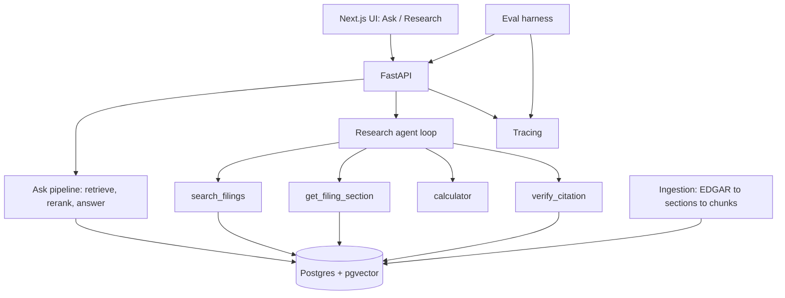

# 10k-agent — Project Plan

2026-09-25

## Overview

**10k-agent is an agentic research assistant that uses RAG, tool calling and automated evaluation to answer grounded, cited questions across SEC 10-K filings.**

The core technical question: can an agent reliably find information across long, messy, cross-referential documents, use tools to analyze it, and prove its answers with citations — and can we measure that?

The filings are the environment, not the product. The project is about document intelligence, so correctness is defined by "did it retrieve, calculate and cite the right thing", not by financial judgment.

| 10k-agent is | 10k-agent is not |
| --- | --- |
| Research over primary-source filings | An "ask me anything about finance" chatbot |
| Grounded answers with verifiable citations | Stock picks, price data or investment advice |
| A measured progression from search to reliable agent | A demo of wiring 15 tools to an LLM |
| Explicit about what the filings don't say | A forecaster |

**Success looks like:** a README that can say "Evaluated on N manually verified questions across 8 companies and 3 fiscal years", with a metrics table showing what each architectural version (V1–V4) added.

## Scope

**MVP corpus: 8 companies × 3 most recent annual 10-Ks = 24 filings, roughly 2,400–7,200 pages.** Small enough to hand-verify a gold set, large enough that retrieval is a real problem.

| Company | Ticker | Fiscal year ends | Why it's useful |
| --- | --- | --- | --- |
| Apple | AAPL | Late September | Product/services revenue mix; FY ≠ calendar year |
| Microsoft | MSFT | June 30 | Segment reporting; FY label runs ahead of calendar |
| Amazon | AMZN | December 31 | Calendar-year baseline; AWS segment |
| Alphabet | GOOGL | December 31 | Filed as Alphabet, not Google — entity-name test |
| Meta | META | December 31 | Two segments; heavy capex narrative |
| NVIDIA | NVDA | Late January | FY2025 is mostly calendar 2024 — hardest FY case |
| Tesla | TSLA | December 31 | Competition and risk-factor questions |
| Netflix | NFLX | December 31 | Simpler filing; good control case |

The mix of fiscal calendars is deliberate: it makes "what was X in 2024?" a genuine disambiguation problem.

| Component | MVP | Later | Never |
| --- | --- | --- | --- |
| Filing type | 10-K | 10-Q, 8-K | |
| Companies / years | 8 / 3 | Expand once eval is stable | |
| Retrieval | Dense + reranking | Hybrid (BM25 + dense) if eval shows keyword misses | |
| Agent + tools | 3–4 tools | `generate_chart` | |
| Calculations | Yes, via tool | | |
| Citations + verification | Yes | | |
| Eval dataset | 50–100 questions | 150+ | |
| Observability / tracing | Yes | | |
| Web search | | Yes, clearly labeled as non-filing source | |
| Stock prices | | | No |
| Investment recommendations | | | No |

## User experience

**One search box, two modes: Ask (single-pass RAG, seconds) and Research (multi-step agent, visible plan and trace).** The contrast between them is itself the demo.

| | Ask | Research |
| --- | --- | --- |
| For | A fact or a short passage | Comparisons, calculations, "why" questions |
| Pipeline | Retrieve → rerank → answer | Plan → tool calls → verify → report |
| Latency target | < 5 s | < 60 s, streamed |
| Output | 1–3 sentence answer + citations | Structured report: summary, table, findings, citations, unverified claims |
| Shows the user | Cited passages | Live step list ("Searching Apple FY2024 10-K…", "Calculating YoY change…") |

Every answer, in either mode, has the same anatomy:

1. **Answer** — the claim, with inline citation markers `[1]`.
2. **Citations panel** — each marker opens the source passage: company, fiscal year, 10-K item/section, and a link to the filing on EDGAR.
3. **Evidence status** — every number is tagged *verified* (found verbatim in the cited passage), *calculated* (with the inputs shown) or *unverified*.
4. **Scope notice** when relevant — e.g. "Filings in this corpus cover FY2023–FY2025; no 2027 figure exists."

A trace view (dev-facing, one click away) shows each tool call, its inputs/outputs, tokens and latency. It doubles as the debugging tool and a portfolio screenshot.

Mode selection starts as a manual toggle. An automatic router (classify question → Ask or Research) is a V4 stretch, and itself evaluable.

## Demo tasks

**Six progressive tasks define what "working" means; each maps to one eval category and drives the architecture.** They are representative workflows, not the only questions the system handles.

| # | Task | Mode | Proves | Eval category |
| --- | --- | --- | --- | --- |
| 1 | "What were Apple's total net sales in fiscal 2022, 2023 and 2024?" | Ask | Ingestion, chunking, retrieval, citations | Retrieval |
| 2 | "What risks does Microsoft identify regarding its dependence on cloud infrastructure and data centers?" | Ask | Semantic retrieval across several sections; synthesis | Grounding |
| 3 | "Compare Apple's and Microsoft's R&D spending from 2022 to 2024." | Research | Cross-document retrieval; fiscal-year alignment; unit normalization | Multi-document |
| 4 | "Calculate the year-over-year percentage change in Apple's R&D spending from 2022 to 2024." | Research | Extraction → calculator tool, no in-head arithmetic | Tool use |
| 5 | "Investigate how Apple's revenue mix changed over the last three years and summarize the factors management cited." | Research | Multi-step plan: tables + MD&A narrative + calculations + cross-check | Agent workflow |
| 6 | "What will Apple's revenue be in 2027?" | Either | Refuses to invent; states what the corpus does cover | Abstention |

**Flagship demo (task 5) expected trajectory:**

1. Identify Apple's three 10-Ks in the corpus.
2. Retrieve the net-sales-by-category table (Item 7 / Notes).
3. Extract iPhone, Mac, iPad, Wearables, Services by year.
4. Calculate each category's share and YoY change.
5. Retrieve MD&A passages explaining changes.
6. Cross-check that extracted numbers appear in the cited passages.
7. Produce report: summary, table, cited management explanations, unverified items.

Open before building: pin down the exact expected answer for each task from the filings, including which fiscal years "the last three years" resolves to.

## Architecture

**A thin stack — Next.js UI, FastAPI, one agent loop, four tools over a single Postgres store — so effort goes into system behavior, not infrastructure.**



### Ingestion

1. **Fetch** 10-K primary documents (HTML) from EDGAR's free APIs, with a declared User-Agent and ≤ 10 requests/s. Store raw HTML for reproducibility.
2. **Section-split** by 10-K Item (1 Business, 1A Risk Factors, 7 MD&A, 8 Financial Statements, …). Section is the unit of citation.
3. **Tables are first-class.** Convert each financial table to Markdown and keep it as one chunk with its caption, column headers (years) and unit line ("in millions"). Splitting tables mid-row is the #1 cause of wrong-number answers.
4. **Chunk prose** at ~500–800 tokens with overlap, never across section boundaries.
5. **Attach metadata** to every chunk (below) and embed.

### Data model

| Table | Key fields |
| --- | --- |
| `companies` | cik, ticker, name, fiscal_year_end_month |
| `filings` | accession_no, cik, form, fiscal_year, period_end_date, filed_date, source_url |
| `sections` | filing_id, item (e.g. "7"), title, char range |
| `chunks` | section_id, text, kind (prose / table), units, years_covered, embedding, tsvector |

`fiscal_year` and `period_end_date` are stored explicitly so the system never infers fiscal years from text.

### Tools

| Tool | Signature (sketch) | Returns |
| --- | --- | --- |
| `search_filings` | query, companies?, fiscal_years?, items?, k | Ranked chunks with chunk IDs + metadata |
| `get_filing_section` | company, fiscal_year, item | Full section text / tables |
| `calculator` | expression or op (pct_change, cagr, ratio) + named inputs | Result with the formula shown |
| `verify_citation` | claim value, chunk_id | Found / not found, matched span |

Metadata filters on `search_filings` are what make comparative questions tractable: the agent searches "R&D expense" filtered to Apple FY2024, rather than hoping the top-5 contains the right company-year.

### Agent loop

- Single agent, native tool use, capped at ~15 tool calls per question.
- System prompt rules: every number must come from a tool result; arithmetic goes through `calculator`; fiscal years resolve against `filings.fiscal_year`; state what's missing rather than guess.
- Final answer is structured output (JSON: claims[], each with value, citation chunk_ids, status) rendered by the UI — this makes citation accuracy machine-checkable.

### Verification (V4)

A deterministic post-pass: for each numeric claim, confirm the value (with unit normalization) appears in its cited chunk; for each calculated claim, re-run the calculation. Failures are downgraded to *unverified* and shown, not hidden.

## Evaluation

**A hand-verified gold set of ~100 questions, scored by the same harness after every version, is the centerpiece of the project.** Build the first 30 questions before writing the retriever, so the eval drives the design.

### Gold dataset

```json
{
  "id": "aapl-rd-fy2024",
  "category": "retrieval",
  "question": "What was Apple's R&D expense in fiscal 2024?",
  "expected_answer": {"value": 31370, "unit": "USD millions"},
  "answer_type": "number",
  "tolerance": 0.005,
  "sources": [{"company": "AAPL", "fiscal_year": 2024, "item": "8", "section": "Consolidated Statements of Operations"}],
  "gold_chunk_ids": ["..."],
  "expected_tools": ["search_filings"],
  "should_abstain": false
}
```

The value above is from memory and must be checked against the filing like every other gold answer.

**Target mix (~100):** 30 retrieval · 15 grounding (narrative) · 15 multi-document · 15 tool use · 10 agent workflow · 15 failure cases. Numeric answers can be cross-checked against EDGAR's structured XBRL data to catch transcription errors in the gold set.

### Metrics

| Layer | Metric | How it's scored |
| --- | --- | --- |
| Retrieval | Recall@5, MRR | Gold chunk IDs vs. retrieved IDs (deterministic) |
| Retrieval | Context relevance | LLM judge, spot-checked by hand |
| Answer | Correctness | Numeric: tolerance match after unit normalization. Narrative: LLM judge vs. rubric |
| Answer | Faithfulness | Every claim supported by cited chunks (LLM judge) |
| Answer | Citation accuracy | Cited chunk contains the claimed value / statement (deterministic for numbers) |
| Agent | Task completion | All required sub-answers present and correct |
| Agent | Tool selection / call correctness | Trace vs. `expected_tools`; arguments valid |
| Agent | Unnecessary calls | Calls beyond a reference trajectory |
| Guardrails | Unsupported-answer rate | Answered when `should_abstain` is true |
| Cost | Latency, tokens, $ per question | From traces |

Calibrate the LLM judge once: hand-grade ~30 answers and report judge-human agreement in the README.

### Failure-case suite

| Failure mode | Example | Correct behavior |
| --- | --- | --- |
| Ambiguous fiscal year | "Apple's revenue in 2024?" | Use FY2024 (ended Sep 2024) and say so |
| Shifted fiscal year | "NVIDIA's revenue in 2024?" | Flag that FY2025 ended Jan 2025; state which it reports |
| Adjacent-column numbers | Tables list 3 years side by side | Pick the right column; cite the table |
| Unit mismatch | Millions vs. billions across companies | Normalize before comparing |
| Entity naming | "Google's capex" | Resolve to Alphabet |
| Out of corpus | "Apple's 2027 revenue?" / "Oracle's revenue?" | Abstain; state corpus coverage |
| False premise | "Why did Netflix stop reporting subscribers in 2019?" | Correct the premise from the filings |

## Roadmap

**Six milestones, each ending with a full eval run so every architectural addition has to earn its place in the results table.** Durations assume part-time work and are rough.

| Milestone | Builds | Exit criteria | Est. |
| --- | --- | --- | --- |
| V0 — Data + gold set | EDGAR fetch, section split, table extraction, DB schema; first 30 gold questions | 24 filings ingested; every Item 7 and Item 8 section present; 30 verified questions | 1–2 wks |
| V1 — Search | Embedding + reranking retriever; CLI; eval harness (retrieval metrics) | Recall@5 and MRR reported on the gold set | 1 wk |
| V2 — RAG | Ask pipeline with cited answers; FastAPI; minimal UI; tracing | Tasks 1, 2 and 6 pass; answer + citation metrics reported | 1–2 wks |
| V3 — Agent | Research mode, 4 tools, streaming step list; gold set to ~100 | Tasks 3–5 complete end to end; agent metrics reported | 2 wks |
| V4 — Reliable agent | Verification pass, structured claims, failure-case fixes, LLM-judge calibration | Failure suite passes; unsupported-answer rate measured and reduced vs. V2 | 1–2 wks |
| Ship | README with V1–V4 results table, architecture diagram, demo video, deployed demo | Someone can run the eval with one command | 1 wk |

Rule for the whole roadmap: when a metric doesn't move, write that down too. An honest "hybrid search didn't help on this corpus" is portfolio material.

## Tech stack

**Recommended: Python + FastAPI, Postgres with pgvector, Claude via the Anthropic SDK with native tool use, a hosted reranker, Langfuse for traces, Next.js for the UI.** Every choice is swappable; none should become the project.

| Layer | Recommendation | Why | Alternative |
| --- | --- | --- | --- |
| Language / API | Python 3.12, FastAPI, uv | Best ecosystem for parsing + eval | — |
| Parsing | BeautifulSoup / lxml on EDGAR HTML | 10-K HTML keeps table structure; PDFs lose it | `unstructured`, `edgartools` |
| Store | Postgres + pgvector + `tsvector` | One DB for metadata, vectors and BM25-style search; SQL filters on company/year | Qdrant, LanceDB |
| Embeddings | A hosted embedding model (e.g. Voyage, OpenAI) | No infra; swap and re-run eval to compare | `bge` / `e5` locally |
| Reranker | Cohere Rerank or Voyage rerank | Largest cheap retrieval win | `bge-reranker` locally |
| LLM | Claude Sonnet 5 for agent + answers; Haiku 4.5 for judge/cheap steps | Strong tool use; cost control on eval runs | Any tool-calling model |
| Agent framework | Hand-written loop on the SDK's tool-use API (~200 lines) | Shows you understand the loop; easier to trace and test | LangGraph, Claude Agent SDK |
| Tracing | Langfuse (self-hosted or cloud) | Traces + datasets + scores in one place | Phoenix, OpenTelemetry |
| Frontend | Next.js + streaming (SSE) | Step-by-step Research view | Streamlit for V1–V2 |
| Deploy | Docker Compose locally; Fly.io / Railway + managed Postgres for demo | Cheap, simple | — |

Keep the eval harness framework-free (pytest-style runner + JSONL results), so the numbers don't depend on any vendor tool.

## Risks and open questions

**The biggest risk is table extraction quality; the biggest decision is whether the agent gets a structured-financials tool.**

| Risk | Impact | Mitigation |
| --- | --- | --- |
| 10-K HTML tables parse badly (merged cells, footnotes, units in captions) | Wrong numbers everywhere downstream | Spend V0 on it; add a table-extraction check to the eval |
| Gold-set building takes longer than code | Eval stays thin | Start in V0; cross-check numbers against XBRL; 30 before V1 |
| LLM-judge scores are noisy | Metrics not credible | Deterministic scoring for numbers; calibrate judge on 30 hand grades |
| Eval runs get expensive | Fewer iterations | Cache retrieval; Haiku for judging; run a 30-question smoke set per change |
| Scope creep (10-Q, web search, charts) | MVP never ships | Hold the "Later" column until V4 ships |

### Open questions

- [ ] **Structured-financials tool?** EDGAR's XBRL "company facts" data gives exact reported values per company-year. Options: (a) use it only to verify the gold set, keeping the agent on document retrieval; or (b) expose it as a `get_financial_facts` tool in V4 and show the accuracy jump. (b) is realistic but makes numeric questions less of a RAG test.
- [ ] Confirm the company list — swap any for a company with a messier filing to stress retrieval?
- [ ] Which three fiscal years exactly (latest filed as of build start)?
- [ ] Deploy a public demo, or local-only with a recorded video? A public demo needs rate limiting and an API budget.
- [ ] Target audience for the README: hiring managers (lead with results table) or engineers (lead with architecture)?
